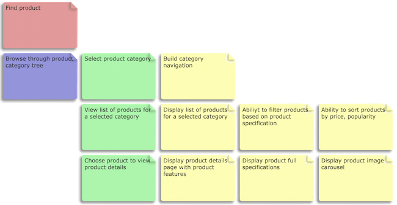

# Testing's purpose

> **tl;dr** To measure and maximise quality delivered, while minimising risk to an acceptable level.

## Theory

Are you looking for the official definition of testing? You won't like it. Fine, here it is:

# DEBUG LINKS

PROD

- OK [same folder, absolute](/concepts/testing-is.md)
- OK [diff folder, absolute](/tools/charters.md)
- NOK [same folder, relative two dots](../concepts/testing-is.md)
- NOK [diff folder, relative two dots](../tools/charters.md)
- NOK [same folder, relative single dot](./testing-is.md)
- NOK [same folder, relative no dot](testing-is.md)

LOCAL

- OK [same folder, absolute](/concepts/testing-is.md)
- OK [diff folder, absolute](/tools/charters.md)
- OK [same folder, relative two dots](../concepts/testing-is.md)
- OK [diff folder, relative two dots](../tools/charters.md)
- NOK [same folder, relative single dot](./testing-is.md)
- NOK [same folder, relative no dot](testing-is.md)

> The process consisting of all life cycle activities, both static and dynamic, concerned with planning, preparation and evaluation of software products and related work products to determine that they satisfy specified requirements, to demonstrate that they are fit for purpose and to detect defects.
>
> — International Software Testing Qualifications Board [(ISTQB)](http://glossary.istqb.org/search/testing)

You just read 43 words in a single sentence. [Hemingway](http://www.hemingwayapp.com/) hates it and your brain hates it too. Instead, let's focus on what is the purpose of testing — why we need it and what it is. From there, we can think about the [responsibilities of a tester](../concepts/responsibilities.md).

Quality is **value to some person, who matters**. A bug is anything that threatens quality. This simple definition shows how subjective quality really is. Here are a few other perspectives:

- Aesthetic view: *Quality is emotive and simplicity.*
  - ✔ Fosters excellence and pride in workmanship.
  - ✘ Can become a cloak for perfectionists.
- Manufacturing view: *Quality is conformance to specifications.*
  - ✔ Fits the mindset of highly regulated contexts, e.g. health industry.
  - ✘ Can produce products that satisfy no one, besides the specification's author.
- Customer view: *Quality is whatever satisfies the customer.*
  - ✔ Increases customer loyalty.
  - ✘ Can lead to eternal chasing of trends and competitors.

Quality is a moving target — it adapts to its changing context (e.g. time, priorities, trends). Stakeholders will form a *perception* of the current quality based on their values, knowledge, skills and past experiences. Given the diversity of stakeholders, each will have a different perception of quality. That's one of the reasons why you cannot _assure quality_.

> Apple shipped the first version of Hypercard with about 500 known bugs in it, yet the product was a smashing success. The Hypercard QA team chose the right bugs to ship with. They also chose the right features.
>
> — [James Bach](http://www.satisfice.com/articles/gooden2.pdf)

Even though you cannot guarantee quality, you can do your best effort to pursuit it. Thus the **purpose of testing** is to measure and maximise quality delivered, while minimising risk to an acceptable level. The more we test, the more we know about our products. With that knowledge, teams can make informed decisions on how to improve the product.

## Practice

Continue reading for specific examples of [what testing is](../concepts/testing-is.md) and [what testing is not](../concepts/testing-is-not.md).

In summary, testing includes these activities:

- TODO
- Identify risks and explore the product to discover if those risks are real and a threat
- Feedback loop: provides information that has been uncovered or confirms if expectations on how the product should work are met
- Exploring the product or executing tests to discover information
- Give feedback to the team and stakeholders, for them to make an informed decision about the next steps to take regarding the product.
- Challenge team assumptions of what the product is and should be.
- Facilitate collaboration and communication between team members.
- Help your team make an informed opinion about the perceived quality of the products and features that they own

## Teachers

- [Ministry of Testing](https://dojo.ministryoftesting.com/)
- [Rapid Software Testing](http://www.satisfice.com/testmethod.shtml)

## Sources

- [Quality is a journey – but do you know your destination?](https://mavericktester.com/2018/03/14/quality-engineering/)
- [The Anatomy of a Definition of Testing](https://qahiccupps.blogspot.pt/2016/11/the-anatomy-of-definition-of-testing.html)
- [Testing Terminology](http://pixelgrill.com/testing-terminology/)
- [The Challenge of "Good Enough" Software](http://www.satisfice.com/articles/gooden2.pdf)
